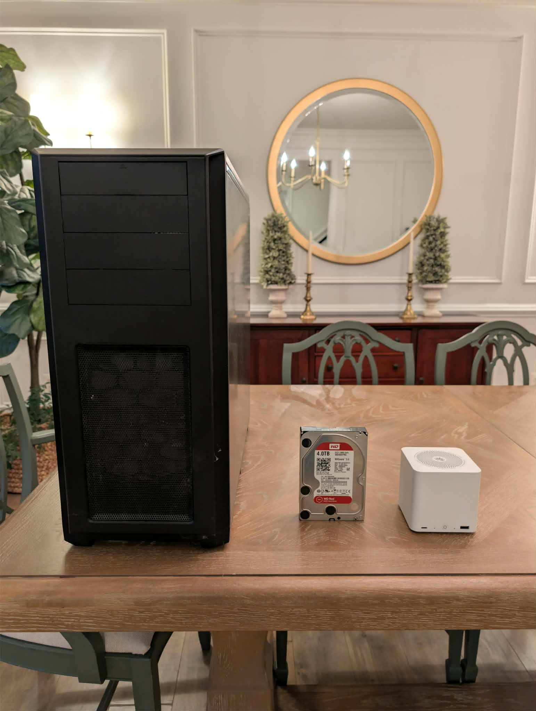
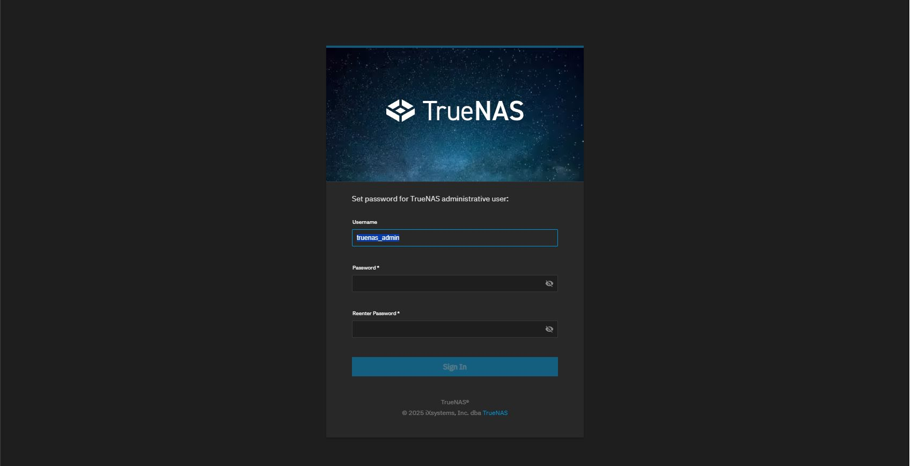
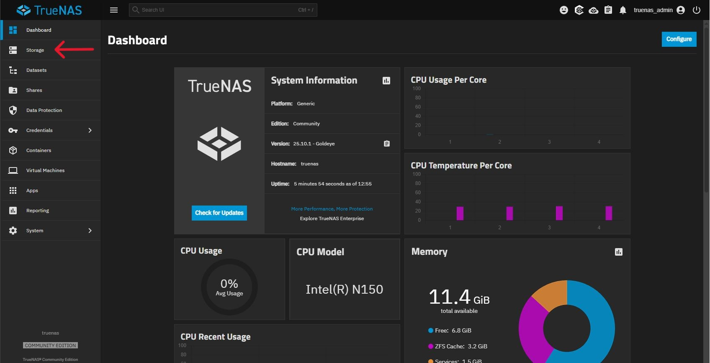
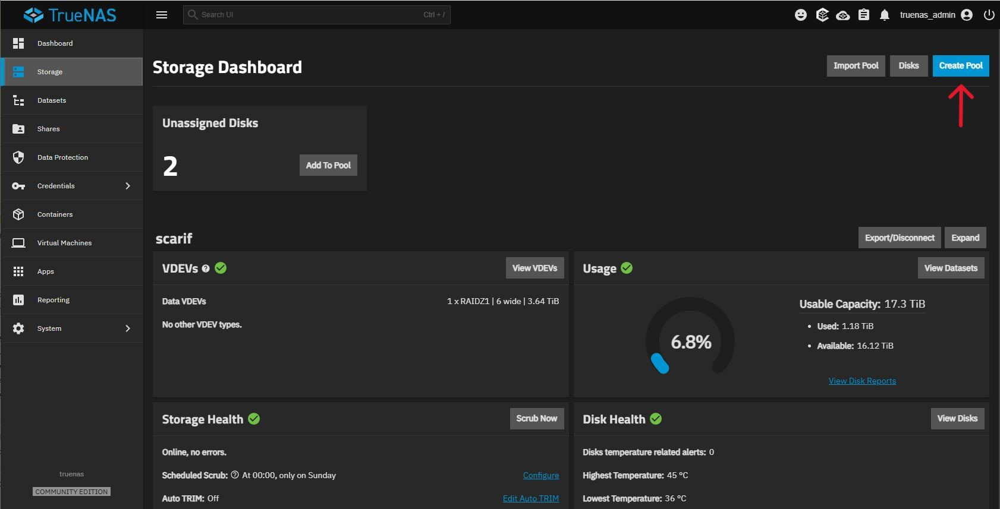
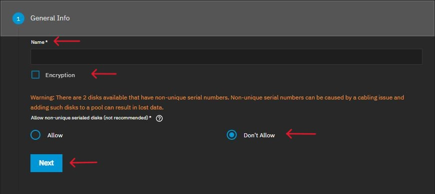
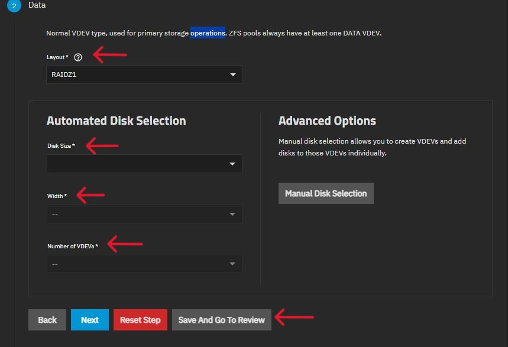
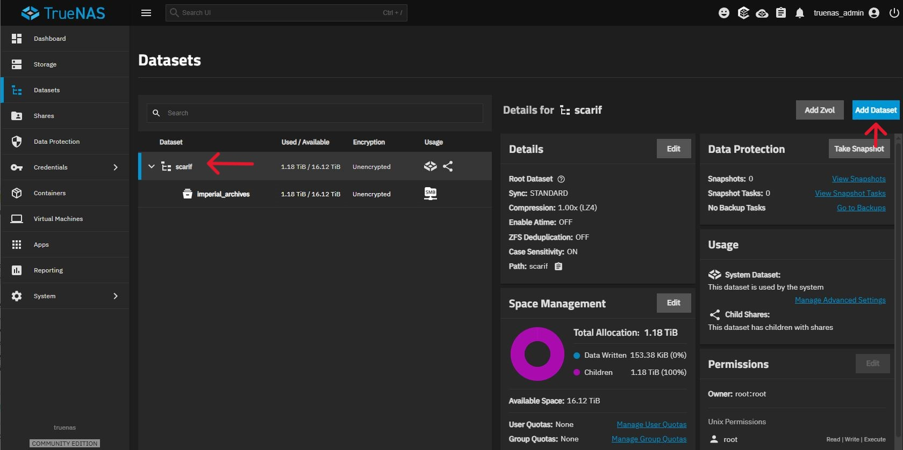
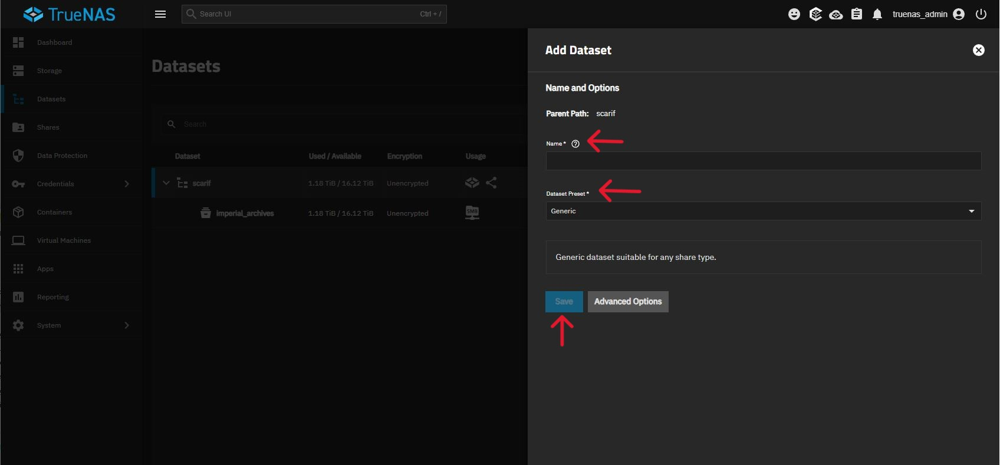

Admittedly, I bought the storage before having a plan, which is probably a classic mistake in technology purchasing decisions. I've been telling myself that a functioning storage layer is critical to the rest of my build (...and honestly, I just really wanted this hardware). This article is part two (part one can be found [here](https://kevinhoman.info/posts/upgrading-my-homelab/)) of my journey to upgrade my homelab beginning with replacing my dead FreeNAS storage array.

FreeNAS Spec Sheet:
- CPU: Intel Xeon E5-2650 - 8c/16t @ 2 GHz
- RAM: 16 GB DDR3
- Storage: 4x 4TB HDD (storage) + 2x Kingston SSD (OS)

Enter the [BeeLink Mini ME](https://www.bee-link.com/products/beelink-me-mini-n150?_pos=2&_fid=e98b58119&_ss=c), a quite literally palm sized device with the capacity of up to six, 4 TB NVMe drives. This amounts to an unformatted storage volume of 24 TB. My initial plan when I purchased this was to run Proxmox on it, and do my entire home lab from this one device. For a minimal setup with Jellyfin, Pihole and even Home Assistant, this device likely has the horsepower to run these. My requirements have changed since purchasing it however, so this will only serve as my home NAS device, with my compute running on separate devices. As a home NAS, it should be up to what I'll be asking of it. 

Beelink ME Mini Spec Sheet:
- CPU: Intel N150 - 4c/4t @ 3.6 GHz turbo
- RAM: 12 GB LPDDR5
- Storage: 6x M.2 NVMe slots + 64 GB EMMC
- Networking: Dual 2.5 GbE
- The Catch: NVMe slot 4 is PCIe 3.0 x2, the other five are x1

When I say this thing is tiny, don't just take my word for it. Here it is compared to my old enclosure, and one of my old HDDs, the Beelink is dwarfed by my old enclosure, and just slightly smaller than the disk. To say its impressive you can get up to 24 TB of aggregate storage in this form-factor is an understatement.



Pros
- Extremely efficient. The included power supply is rated at 45W, but actual draw sits closer to 15-20W. This thing is also damn near silent. (mine is in the basement so this is a non-factor for me)
- EMMC plus six NVMe slots equals a lot of storage in a very small form-factor
- Affordability (of the enclosure). When compared with other NAS enclosures, the price point on this is extremely tempting

Cons
- Tricky installation of TrueNAS (more on this in a bit)
- That power efficiency leads to some device limitations
- Filling this with NVMe drives (especially 4 TB sticks) is potentially expensive (but SOOOOO worth it) and pushes the limits of the power supply (use low power NVMe if possible)
- Running TrueNAS on this loses you the ability to use WiFi (which probably doesn't matter)

Expanding on some of these cons a bit. The big thing from everything I've read indicates Beelink may have purposefully limited areas of this device for stability and longevity over pure performance. While NVMe slot 4 is dual lane PCIe 3.0, the remaining five are all single lane. Given this will limit your bandwidth, going whole hog on the fastest flash drives you can find will not only be overkill, but a waste of your money. For power users, you can use slot 4 to install your OS while using the remaining five for your storage pool if you opt to not use the EMMC storage for the OS. If you're a home user, using the EMMC so you have six slots for your storage pool will be adequate. You will also see these limitations show up in the networking should you choose (and I very much recommend you do) to bond the NICs together. If you choose to bond the NICs, don't expect to see your file transfers hit 5 Gbps. LACP expands the throughput for multiple clients, just keep in mind that the speed of the stream itself remains the same.

For the average home user, I think this thing is a no-brainer, again just realize that filling it with storage won't be cheap. Power users will obviously have to do an analysis of their needs against the performance the ME Mini can offer, but its a super tempting device. For me, this will largely serve as file and media storage while the rest of my lab will run on more performant devices, so the tradeoff here (plus the need in general) makes this device worth it for me.

As an x86 device, the Mini will support a wide range of operating systems:
- Linux
- Proxmox
- TrueNAS
- ZimaOS
- Unraid

It comes with Windows 11 pre-installed (if you purchase with an NVMe option), but I think we can agree this isn't a very NAS-centric operating system. I opted to install TrueNAS SCALE on the EMMC storages. A little patience is required when you get to the actual installation portion, which you will likely have to attempt multiple times. This is likely due to the TrueNAS installer not being able to reference EMMC as a storage type, requiring you to brute force that portion of the script to fail so TrueNAS will (eventually) install. This installation does require you to drop into the console to run some commands, so I do recommend you at least feel comfortable with running Linux commands if you're going to run this install.

First things first, download the TrueNAS SCALE ISO (25.10.1 at the time of this article) and burn the image to a USB stick with something like Balena Etcher or Ventoy. A quick note here, in one of the articles I read preparing for my install the writer had lots of problems with their install they thought was related to a 25 Release of TrueNAS. The 25.10.1 release has been stable for me, and outside of the installation quirks, I have had no major issues. With your ISO burned to a USB stick, plug in the stick, a keyboard and external monitor and you're ready to get started.

The first step is unlocking the bootloader so we can install TrueNAS on the EMMC drive.
- Power on the device, when you reach the bootloader screen you should see 'Start TrueNAS SCALE Installation', select this option and press 'Enter'
- When you reach the installer screen, select '2 Shell' and press 'Enter'
- Once you're in the shell, check the read/write flags of your drives with the lsblk command. This should return all drives currently attached to the device (including NVMe). We're interested in any drives labeled 'mmcblk0', and you should see two of them, 'mmcblk0boot0' and 'mmcblk0boot1'. Each drive will have a column labeled 'RO', and both these drives should have a value of '1', indicating read-only.
- Change the 'RO' flag to write only on both boot volumes with the following commands:
```bash
echo 0 > /sys/block/mmcblk0boot0/force_ro
```
```bash
echo 0 > /sys/block/mmcblk0boot1/force_ro
```

- Next you want to zero out the EMMC space. If you purchased this directly from Beelink, there should be nothing on the EMMC storage, if you had previously installed something on your Beelink, this will ensure any partitions left over from that install are erased. We can do this with the following command:

```bash
dd if=/dev/zero of=/dev/mmcblk0 count=1024 
```

WARNING: the above command will wipe the drive(s), triple-check that your target drive is actually mmcblk (the EMMC space) and not your USB installer or an NVMe drive.

- Return to the TrueNAS installation screen by typing in 'exit' in the console, and pressing 'Enter'

Now it's time for the fun to begin, installing TrueNAS on the EMMC. The EMMC storage and TrueNAS's installer have a little bit of a fued going on here. It took me fifteen attempts to get the installer to work. If your install fails, and it will...likely multiple times, don't panic, stick with it, you just need to out-stubborn this combination.
- Select '1 Install' and press 'Enter'
- Select 'mmcblk0' as your storage target and press 'Enter'
- Select 'Configure using Web UI' and press 'Enter'

Installation will eventually begin (YMMV on how many attempts it takes), when the installer completes, remove your installation media and press 'Enter' to reboot the device. When the device reboots to the bootloader, select 'TrueNAS SCALE GNU/Linux {version}' and press 'Enter'. At this point, make sure the device is plugged into your network. When TrueNAS finishes booting up, you will see an IP address listed on the console screen, you'll need this address to access the web UI and finish setting up the device. Navigate to this IP address from your web browser, and you should see the following screen:



Set a password for the truenas_admin user, confirm it and press 'Enter'

Now that we have access to our new TrueNAS installation, let's go ahead and make it useable. The first step is to create a storage pool. Click 'Storage' in the menu on the left side of the screen as shown below:



You should be met with a screen that tells you that no pools are currently configured (the below screenshot shows a configured pool because I forgot to take this screenshot at creation time), click on the 'Create Pool' button in the top right of the screen (and yes, I DID name my storage pool Scarif).



Under the 'General Info' section, give your pool a name. You can also choose to enable encryption on the pool at this time. Leave the warning for two disks having non-serial numbers set to 'Don't Allow'. This warning exists because TrueNAS can see your EMMC storage. Click 'Next' once complete.



Moving on to the 'Data' section, select your 'Layout' for the pool (I suggest using a RAIDZ layout). Select the size of the disk you'd like to use, the width of your pool (the number of drives you'd like assigned) and the number of VDEVs your pool should be configured with.



At this point, you can click 'Save And Go To Review' as the remaining sections are optional. Review your selections and click 'Create Pool', check the 'Confirm' button then click 'Continue'.

You should come back to the 'Storage Dashboard' as seen above and will notice an 'Unassigned Disks' block at the top of this page. In this case, that will be normal as TrueNAS is seeing the EMMC storage, so just ignore this.

Click the 'Datasets' in the menu on the left side of the screen to create a new Dataset. 


Click on your storage pool, then click 'Add Dataset' at the top right of the screen.



- Configure your dataset with a descriptive name
- Select the kind of dataset you'd like to share. For home users, SMB will probably work best, although if you're a home Linux user 'Multiprotocol' could be a good option as well. For any option you select that creates an SMB share, make sure you configure an SMB Name as well.
- Click 'Save'. Select your compression type, then make sure the service is set to 'Enable this service to start automatically' and click 'Start'.



All you'll need now is to create a user to access the dataset from another computer (which you can do by clicking 'Credentials', then 'Users'). But you are now largely set to start using this device as your new NAS. The great thing about TrueNAS is just how flexible it is, from the average home user, to power users there is a setting/configuration for you. The sky is honestly the limit for you pretty much. For me, I have two items on my checklist I need to complete later, configuring my NICs in a LAG, and setting up Nextcloud. My next article in this series will be my networking article, and I will configure the LAG on this device when I install and configure my new switch (which is currently sitting in its box). I would also like to setup Nextcloud, so I can access this from other devices when I'm out of the house. That's going to be a more in depth configuration so will likely take a bit of time to get to. Nextcloud offers an application that you can install and run directly from TrueNAS, I'm leaning more towards running it as a container/VM from my compute when I get that up and running. I'm not entirely sure what I'm going to do here.

The Verdict:
For $329, the Beelink ME Mini punches far above its weight class. It's not a powerhouse compute node, configured as a pure NAS it's a silent, understated workhorse. At the time of this writing, I've had mine up and running for a little over a week now, no issues, running smooth and stable. Most of that time has been in restoring backups from my previous NAS. While installing TrueNAS required a bit of patience, the result is lots of storage that fits in the palm of my hand. I am arguably more excited about this tiny box than the rest of my lab combined currently.

Before closing out, a few references I found to be very helpful and informative in my build. In addition to hoping you find this particular piece helpful, I hope you find these to be the same, and of course thank you to those who made my work significantly easier.

- [Beelink ME Mini NAS Review](https://hagensieker.com/2025/11/03/beelink-me-mini-nas-review/)
- [This Mini PC Has a Hidden Surprise Inside!](https://www.youtube.com/watch?v=Z96RB6QBugk&t=1065s)
- [It's better with Proxmox... Beelink ME Mini PC NAS](https://technotim.live/posts/proxmox-lxc-me-mini/)
- [My Experience (and Struggles) with the Beelink ME Mini as a NAS](https://dev.to/torchilidae/my-experience-and-struggles-with-the-beelink-me-mini-as-a-nas-26g3)

If you're in the market in 2026 for a new NAS, I really do believe this is the device for you, I hope you find this article helpful in your configuring adventures!